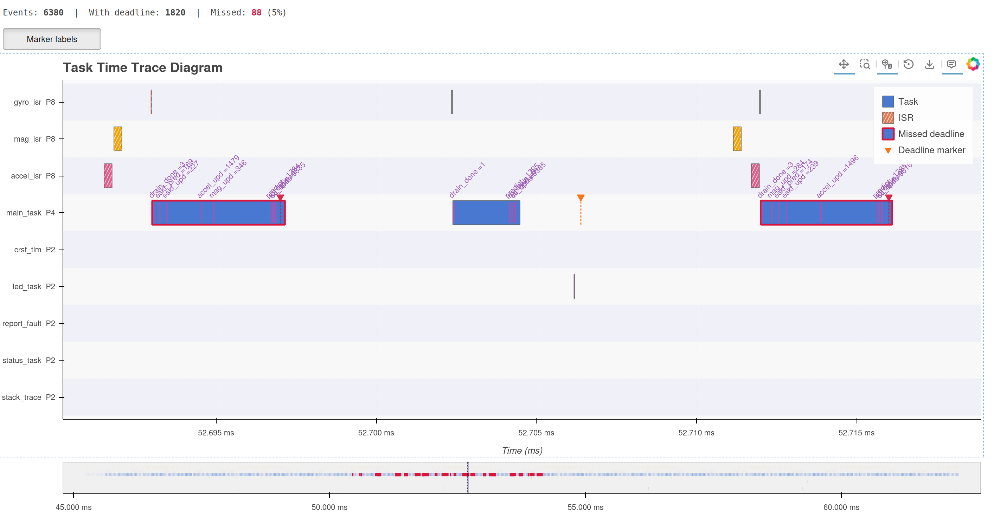

# execution-trace

`no_std` embedded execution tracing with transport-agnostic span/marker recording and protobuf
wire framing.

Records named time spans (task activations, ISR executions) and point-in-time markers on
bare-metal targets without a heap or OS. Events are serialised as length-delimited protobuf
frames that you forward over any byte transport — RTT, UART, USB, or a ring buffer for
post-mortem analysis.



## Quick start

### 1. Implement `TraceSink` for your transport

```rust
use execution_trace::{TraceSink, TracingError, TraceEvent};

struct MyRttSink { /* ... */ }

impl TraceSink for MyRttSink {
    fn try_send(&mut self, event: TraceEvent) -> Result<(), TracingError> {
        // encode and forward the event bytes over your chosen transport
        Ok(())
    }

    fn get_elapsed_nanoseconds(&self) -> u64 {
        // return hardware timer value; the default impl returns 0
        hardware_timer_ns()
    }
}
```

### 2. Record spans and markers

```rust
use execution_trace::{TraceSink, TraceEventSourceType};

fn my_isr(sink: &mut impl TraceSink) {
    // at priority 8, with a payload of 3 (e.g., an iteration counter value or similar)
    sink.record_span_start("my_isr", TraceEventSourceType::Isr, 8, Some(3)).ok();
    // ... work ...
    sink.record_span_end("my_isr").ok();
}

fn ukf_step(sink: &mut impl TraceSink) {
    // without a payload
    sink.record_marker("predict", None).ok();
    // ...
}
```

### 3. Encode with sequence tracking

Use [`SequenceEncoder`] when encoding events manually so the host can detect dropped frames:

```rust
use execution_trace::{SequenceEncoder, encode::MAX_TRACE_FRAME_SIZE};

let mut enc = SequenceEncoder::new();
let mut buf = [0u8; MAX_TRACE_FRAME_SIZE];
let n = enc.encode(&event, &mut buf)?;
transport.write(&buf[..n]);
```

### 4. Decode on the host

```rust
use execution_trace::encode::decode_trace_frame;

let (event, consumed) = decode_trace_frame(&raw_bytes)?;
```

## Wire format

Each frame is a standard protobuf length-delimited record:

```
[ varint: payload byte count ][ protobuf-encoded TraceEvent ]
```

Maximum frame size is [`encode::MAX_TRACE_FRAME_SIZE`] (128 bytes). Name strings are capped at 32 bytes;
longer names cause `record_*` to return [`TracingError::MessageDropped`] before sending.

## Host-side tooling

The companion Python package `execution-trace` decodes the binary stream, matches span start/end pairs,
and renders a zoomable Bokeh timing diagram as a standalone HTML file. The intermediate format is
a CSV with columns `name`, `type`, `start_us`, `end_us`, `priority`, `deadline_us`, and `value`.

## `no_std` usage

The crate is `no_std` by default. Enable the `std` feature for tests:

```toml
[dev-dependencies]
execution-trace = { version = "0.1", features = ["std"] }
```
